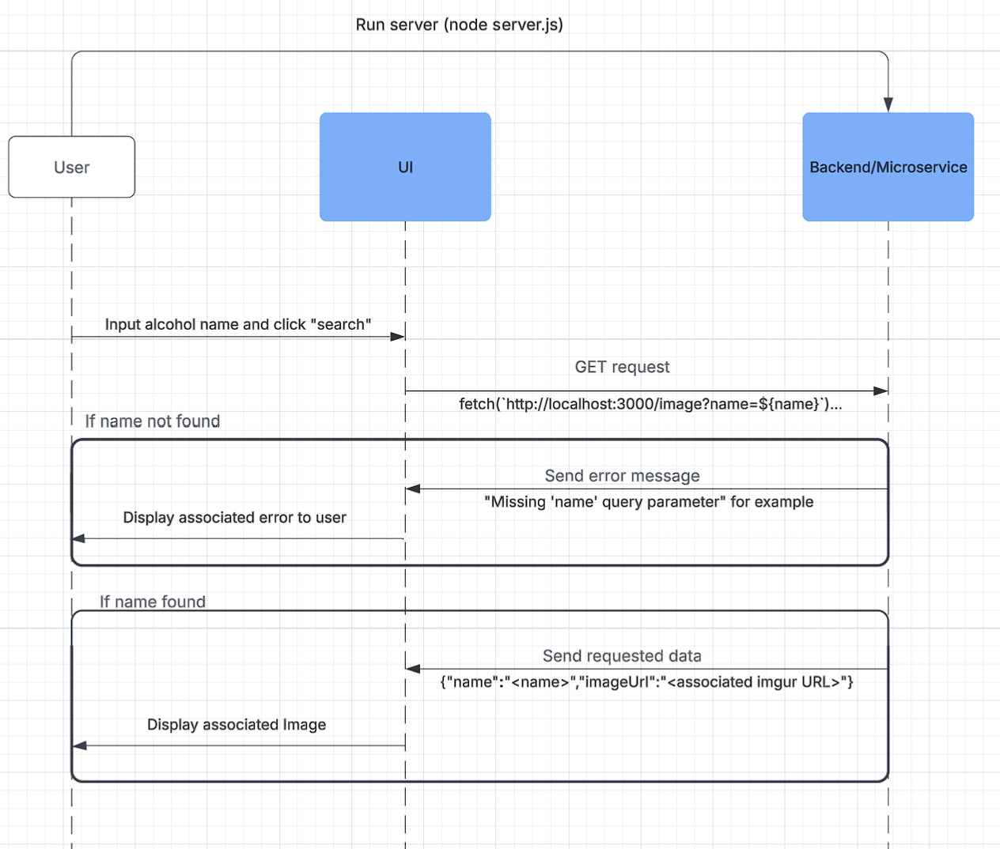

# alcohol-photo-generator
This is a microservice created for a classmate from CS361: Software Engineering 1. It is meant to receive the name of an alcohol as input and output an image url corresponding to the name. The images are hosted in on my an imgur account using my OSU email.

Link to imgur profile: https://imgur.com/user/coopthompson12/posts

PART 3

Communication Contract: This program is built as an express server and written in JavaScript. To communicate, ensure the correct dependencies are implemented (node, express, cors) which you can do buy running npm install <dependencyName>. Once your dependencies are all installed, you can run the server using node server.js. It should ouput "Alcohol Image API is running on port 3000" if it was successful. After that, you can query the page using a fetch request like so: fetch(`http://localhost:3000/image?name=${name}`). You could potentially use other web dev dependencies to enhance your queries but this is the method I chose and does not require any additional installs. The fetch request queries the port where the server is running (port 3000) and should return the imgur direct image URL associated (or an error message if there was no match). It does this by searching a dicionary object for the name of the alcohol being queried, the name of associated alcohols to the one being queried, or try to string match the input and an existing string and image pair if both previous methods failed. This image url can be used on a webpage to display the image using  HTML tags. Just input the URL into the src attribute of the tag and the image should appear on your page. This is the intended use of the program but you could use the URL in some other way if that is the desire. In summary, run the server using node server.js, input the name of the alcohol you would like to receive an image for, and the output should be an imgur direct url link or an error message.

A. Here is the explicit example call my test program utilizes:

function fetchImage() {
    const name = document.getElementById('alcoholName').value.trim();
    if (!name) {
        alert("Please enter a name!");
        return;
    }
    fetch(`http://localhost:3000/image?name=${name}`)
        .then(response => response.json())
        .then(data => {
            if (data.error) {
                alert("Image not found for the given name.");
                document.getElementById('alcoholImage').style.display = 'none';
            } else {
                document.getElementById('alcoholImage').src = data.imageUrl;
                document.getElementById('alcoholImage').style.display = 'block';
            }
        })
        .catch(error => alert("Error fetching data."));
}

This will run when the "Search" button on the webpage I made is clicked. The test webpage is included in the github repo for ease of use. This will run a GET request to server.js. Here is the associated code for reference:

app.get('/image', (req, res) => {
    ...code runs here...
});

B. Here is part of the example test input from before:

fetch(`http://localhost:3000/image?name=${name}`)
        .then(response => response.json())
        .then(data => {
            if (data.error) {
                alert("Image not found for the given name.");
                document.getElementById('alcoholImage').style.display = 'none';
            } else {
                document.getElementById('alcoholImage').src = data.imageUrl;
                document.getElementById('alcoholImage').style.display = 'block';
            }
        })
        .catch(error => alert("Error fetching data."));

This uses JavaScript promises to query for the data. The response occurs where it is received as a JSON object, checks if any error was triggered in the backend code (if an error did occur, the style of the page is changed slightly to reflect that no image URL has been received). If the url was returned correctly, the  is selected on the page and the url is input into that  src attribute. 

For example, if name = smirnoff, the output would be a JSON object that looks like this:
{"name":"vodka","imageUrl":"https://i.imgur.com/gVgm7gt.jpg"}

C:

